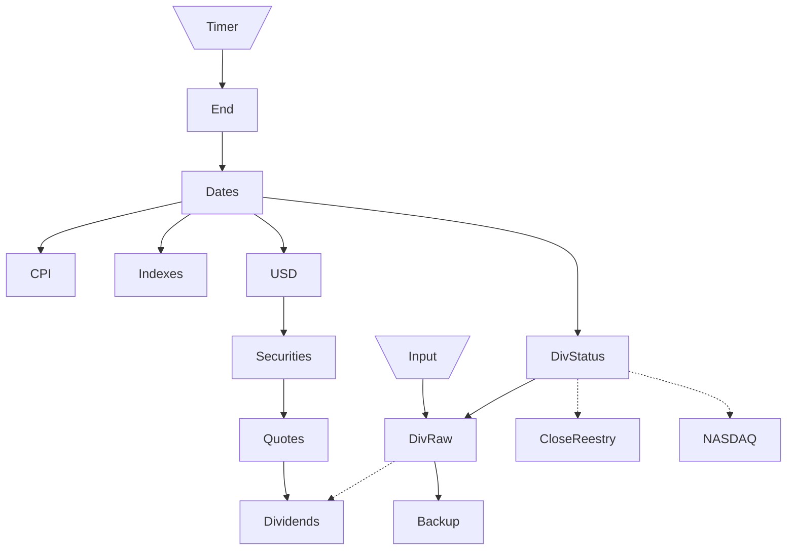

# Микросервис для загрузки данных

Прототип в разработке - не используется в основном коде

## Endpoints

### api/{group}/{ticker}

Получение данных в формате MongoDB Extended JSON (v2)

### edit/{ticker}

Frontend для дополнения данных по дивидендам

## Event streams
