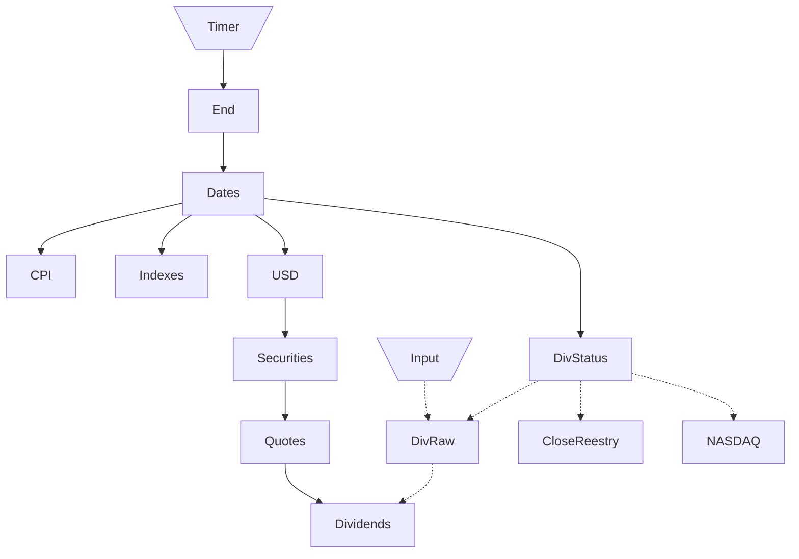

# Микросервис для загрузки данных

Прототип в разработке - не используется в основном коде

## Поток событий

```mermaid
flowchart
    Timer[\Timer/]-->End
    End-->Dates
    
    Dates-->CPI
    Dates-->Indexes
    Dates-->USD
	Dates-->DivStatus

	USD-->Securities
    Securities-->Quotes
	Quotes-->Dividends
    
    Input[\Input/]-.->DivRaw
    DivRaw-.->Dividends
    
    DivStatus-.->DivRaw
    DivStatus-.->CloseReestry
    DivStatus-.->NASDAQ
```