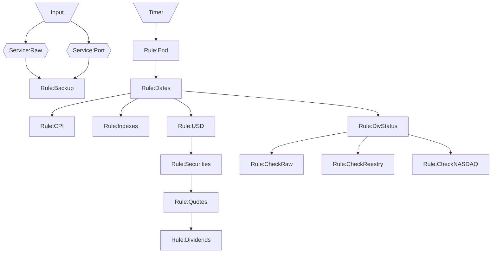

# Микросервис для загрузки данных

Прототип в разработке - не используется в основном коде

## Endpoints

### api/{group}/{ticker}

Получение данных в формате MongoDB Extended JSON (v2)

### edit/div/{ticker}

Frontend для дополнения данных по дивидендам

### edit/port/tickers

Frontend для изменения перечня бумаг в портфеле, для которых необходимо отслеживать появление новых дивидендов

## Event streams

Основные потоки событий между правилами обработки событий изображены на схеме. 
Дополнительно каждое правило в случае возникновения ошибки направляет событие с ее описанием, 
которое обрабатывается специальным правилом записывающим сообщение в лог и Telegram.
