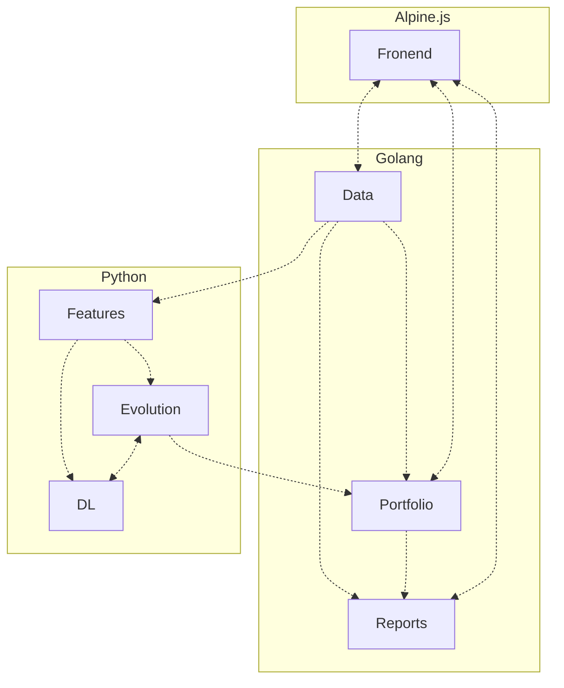
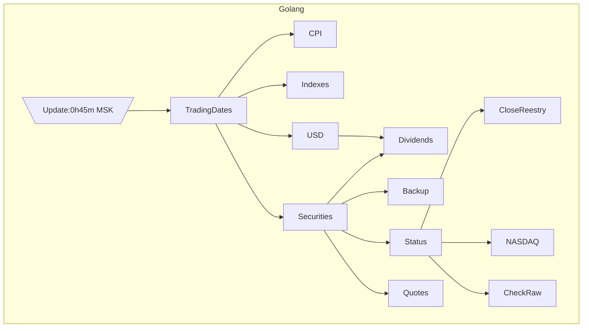
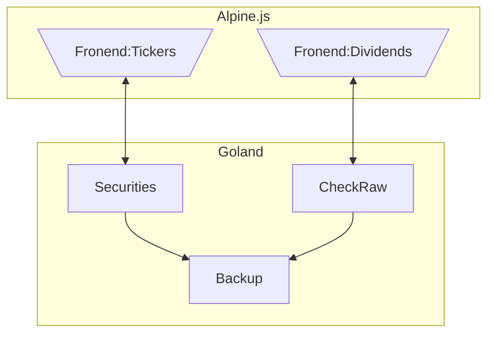
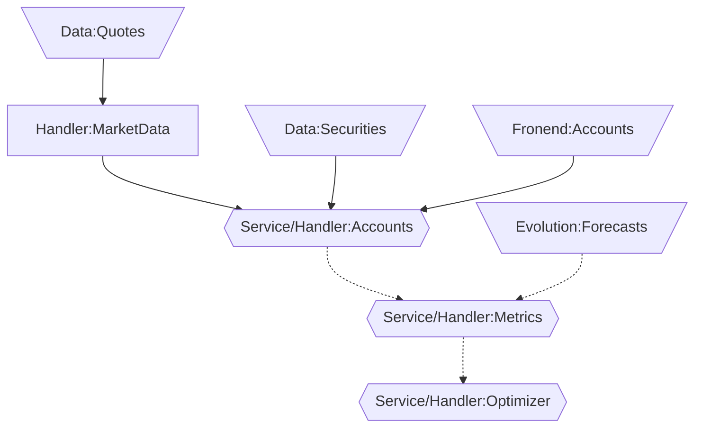

# Новая версия программы

Находится в разработке - пока используйте версию на Python.

Большая часть будут реализована на Go, обучение сетей на Python и Frontend на Alpine.js

## Frontend

Реализован Alpine.js в виде SPA со следующими основными разделами

### Tickers

Изменение перечня бумаг в портфеле, для которых необходимо отслеживать появление новых дивидендов среди всех бумаг, 
обращающихся на MOEX

### Dividends

Обновление данных по дивидендам - производится сверка данных с информацией на сайтах:

- [www.nasdaq.com](https://www.nasdaq.com/)
- [закрытияреестров.рф](https://закрытияреестров.рф/)

Имеется возможность принятия отсутствующих, удаление лишних или ручного добавления новых значений.

### Accounts

Редактирование перечня брокерских счетов и находящихся на них бумаг

### Portfolio

Отображение суммарной стоимости и состава портфеля

### Metrics

Просмотр информации об ожидаемой доходности и риске портфеля

### Optimizer

Просмотр предложений по оптимизации портфеля

### Reports

Просмотра исторических отчетов

## Основные модули

## Модуль Data

Отвечает за обновление данных, большая часть выполняется автоматически.

### Модуль Data - автоматическое обновление
Отвечает за регулярное обновление данных, которые в последствии используются модулями. Обновление осуществляется 
ежедневно после 0h45m MSK, когда на MOEX ISS обычно публикуются данные по итогам торгов. Если в процессе обновления 
возникают ошибки, то ни логируются и отправляются в Telegram, а сам процесс по возможности продолжается.  

Координацией обновления занимается сервис Update, а основные этапы показаны на диаграмме.

### Модуль Data - ручное обновление данных

Вручную вводятся данные о дивидендах и выбранных тикерах для портфеля тикерах, чтобы для них отслеживалась актуальность
данных по дивидендам.

## Модуль Portfolio

Отвечает за редактирование состава брокерских счетов и анализ портфеля.

Основные потоки событий между обработчиками событий изображены на схеме. Дополнительно каждое правило в случае
возникновения ошибки направляет событие с ее описанием, которое обрабатывается специальным правилом записывающим
сообщение в лог и Telegram.

