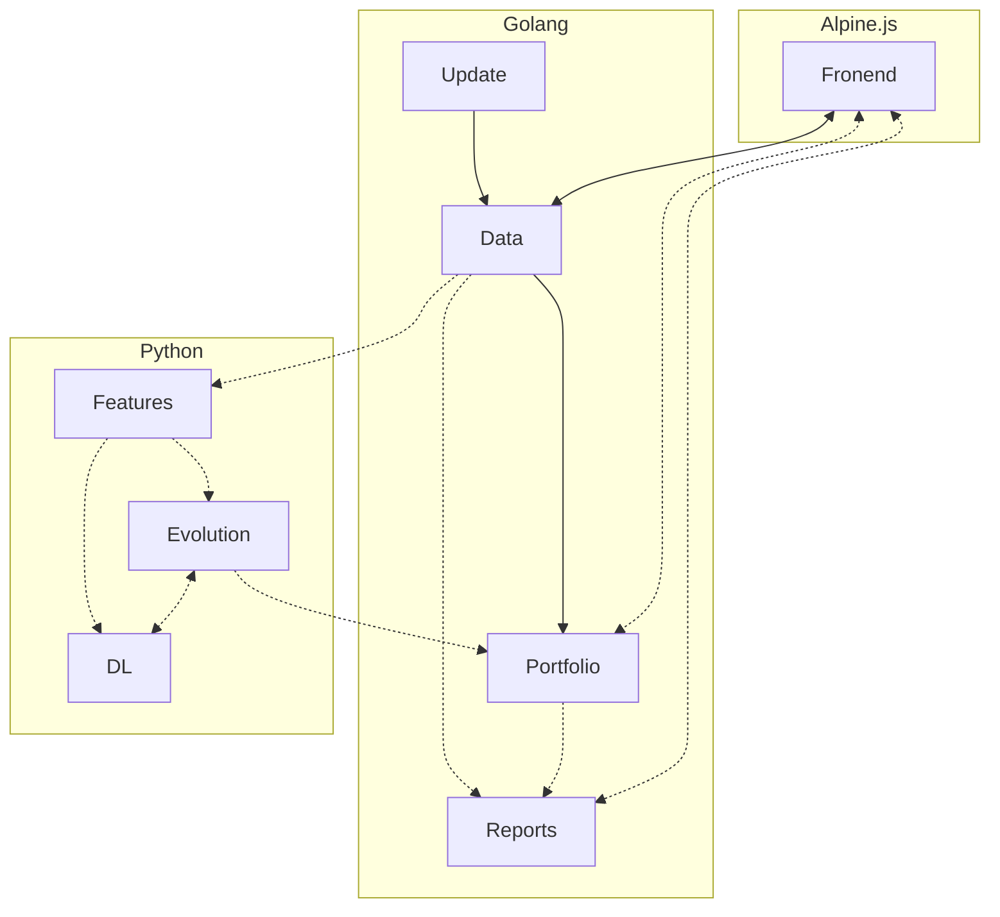
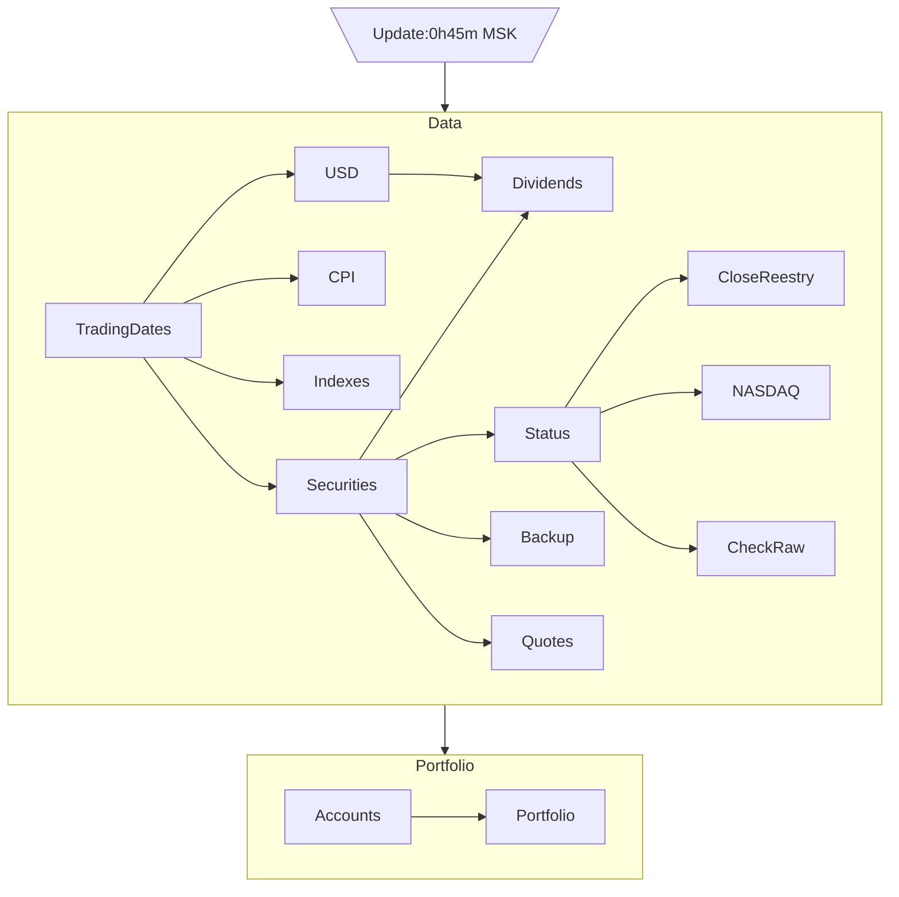
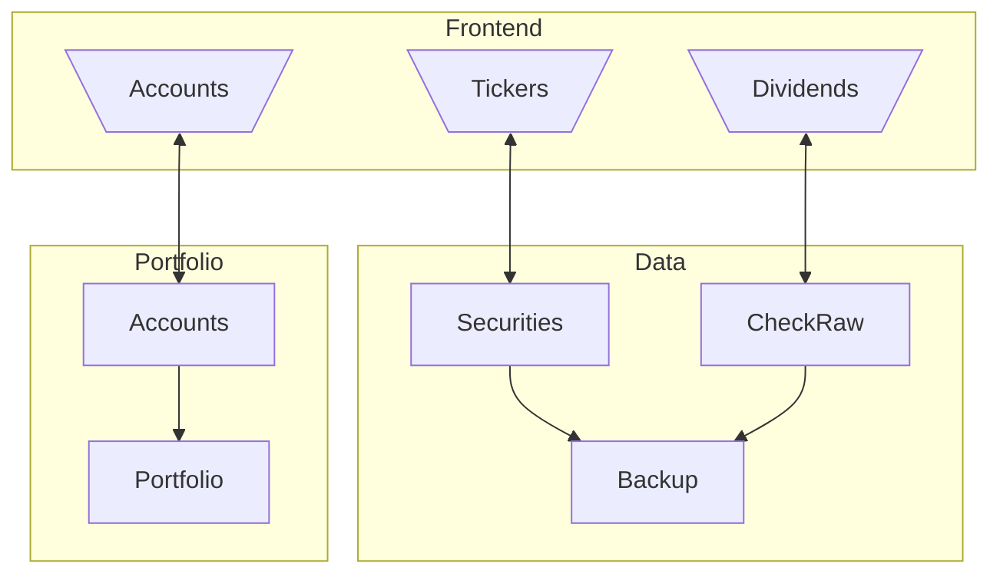

# Новая версия программы

Находится в разработке - пока используйте версию на Python.

Большая часть будут реализована на Go, обучение сетей на Python и Frontend на Alpine.js

## Frontend

Реализован Alpine.js в виде SPA со следующими основными разделами

### Tickers

Изменение перечня бумаг в портфеле, для которых необходимо отслеживать появление новых дивидендов среди всех бумаг, 
обращающихся на MOEX

### Dividends

Обновление данных по дивидендам - производится сверка данных с информацией на сайтах:

- [www.nasdaq.com](https://www.nasdaq.com/)
- [закрытияреестров.рф](https://закрытияреестров.рф/)

Имеется возможность принятия отсутствующих, удаление лишних или ручного добавления новых значений.

### Accounts

Редактирование перечня брокерских счетов и находящихся на них бумаг

### Portfolio

Отображение суммарной стоимости и состава портфеля

### Metrics

Просмотр информации об ожидаемой доходности и риске портфеля

### Optimizer

Просмотр предложений по оптимизации портфеля

### Reports

Просмотра исторических отчетов

## Основные модули

## Автоматическое обновление
Большая часть данных обновляется на ежедневной основе после 0h45m MSK, когда на MOEX ISS обычно публикуются итоги 
торгов. Координацией обновления занимается сервис Update, которой сначала обновляет рыночные данные, а после этого 
запускает расчет актуализированной стоимости отдельных счетов и портфеля в целом. Если в процессе обновления возникают 
ошибки, то ни логируются и отправляются в Telegram, а сам процесс по возможности продолжается. Более подробно 
последовательность обновления изображена на диаграмме

## Ручное обновление данных

Вручную вводятся данные о дивидендах, выбранных для портфеля тикерах, чтобы для них отслеживалась актуальность
данных по дивидендам, и перечне и составе счетов. 

