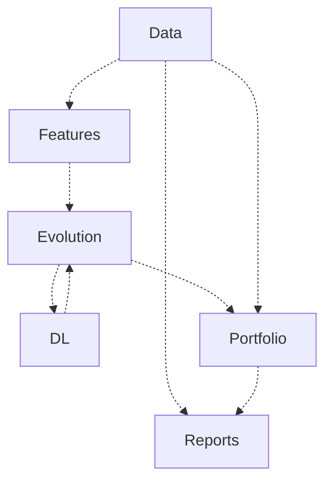
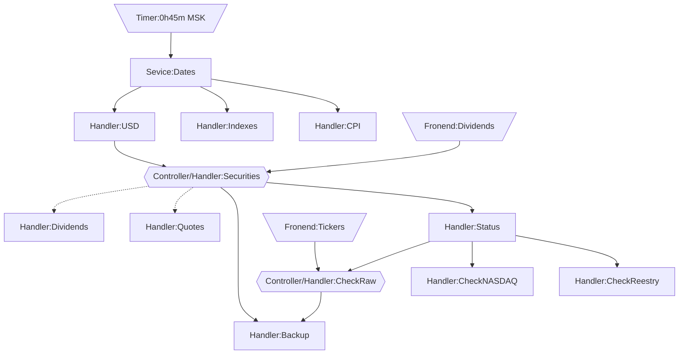

# Новая версия программы

Находится в разработке - пока используйте версию на Python.

Большая часть будут реализована на Go, обучение сетей на Python и Frontend на Alpine.js

## Frontend

Реализован Alpine.js в виде SPA со следующими основными разделами

### Tickers

Изменение перечня бумаг в портфеле, для которых необходимо отслеживать появление новых дивидендов среди всех бумаг, 
обращающихся на MOEX

### Dividends

Обновление данных по дивидендам - производится сверка данных с информацией на сайтах:

- [www.nasdaq.com](https://www.nasdaq.com/)
- [закрытияреестров.рф](https://закрытияреестров.рф/)

Имеется возможность принятия отсутствующих, удаление лишних или ручного добавления новых значений.

### Accounts

Редактирование перечня брокерских счетов и находящихся на них бумаг

### Portfolio

Отображение суммарной стоимости и состава портфеля

### Metrics

Просмотр информации об ожидаемой доходности и риске портфеля

### Optimizer

Просмотр предложений по оптимизации портфеля

### Reports

Просмотра исторических отчетов

## Основные модули

## Модуль Data

Отвечает за сбор данных, которые в последствии используются для построения признаков, расчета стоимости портфеля и 
подготовки отчетов.

Основные потоки событий между обработчиками событий изображены на схеме. Дополнительно каждое правило в случае 
возникновения ошибки направляет событие с ее описанием, которое обрабатывается специальным правилом записывающим 
сообщение в лог и Telegram.

