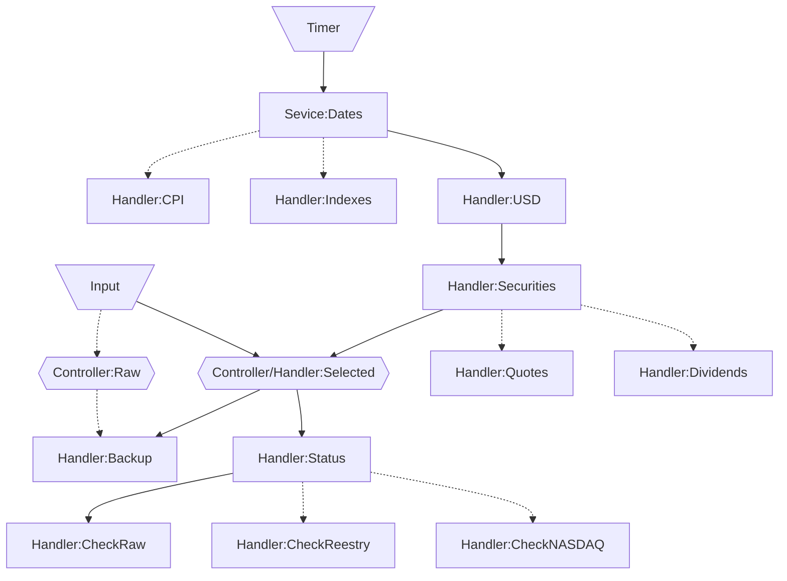

# Новая версия программы на Go

Находится в разработке - пока используйте версию на Python

## Endpoints

### /

Перенаправляет на /tickers

### /tickers

Frontend для изменения перечня бумаг в портфеле, для которых необходимо отслеживать появление новых дивидендов

### /accounts

Frontend для редактирования данных об отдельных брокерских счетах

### /portfolio

Frontend для просмотра суммарной стоимости портфеля по всем счетам

### /metrics

Frontend для просмотра информации об ожидаемой доходности и риске портфеля

### /optimizer

Frontend для просмотра предложений по оптимизации портфеля

### /dividends

Frontend для дополнения данных по дивидендам

### /reports

Frontend для просмотра исторических отчетов

## Event streams

Основные потоки событий между обработчиками событий изображены на схеме.
Дополнительно каждое правило в случае возникновения ошибки направляет событие с ее описанием,
которое обрабатывается специальным правилом записывающим сообщение в лог и Telegram.
